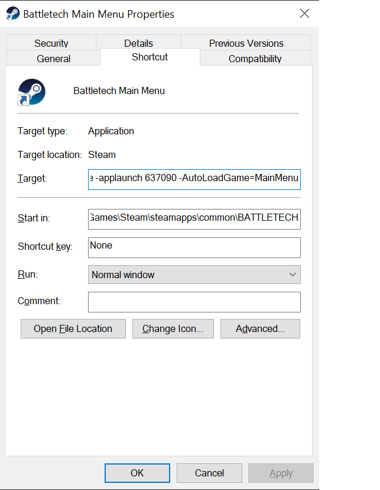

# AutoLoadGame

This is the continuation of gniver's excellent AutoLoadGame mod.  Gniver has transferred the mod for continued development.
Original mod:  https://www.nexusmods.com/battletech/mods/493

# Usage
Simple mod; it loads your most recent game automatically, or go into Skirmish MechBay.  Yes, the entire point is not having to click the buttons.  

It doesn't care if it's career or campaign or skirmish, whatever is most recently saved will be loaded immediately after the game scans your save files.  Or, goes to MechBay (see readme.txt).

## Loading operation
The mod operates as follows:

* By default will load the last save.
* If a [command line argument](#command-line-options) is present, the game will open the specified screen.
* Or, while ModTek is loading:
  * Hold SHIFT to display the main menu normally.
  * Hold CTRL to toggle modes between Save and MechBay auto-loading (See readme.txt)


# Command Line Mode

The parameter -AutoLoadGame={option} can be added on the command line or in a shortcut to specify which screen to launch.

This allows a developer to quickly launch to various screens without needing to disable the mod or hold down shift.

## Steam Shortcut (App ID)
To create a shortcut with the AutoLoadGame parameters, create a new desktop shortcut and set the Target to the following:

```
{SteamDir}steam.exe -applaunch 637090 -AutoLoadGame={option}
```

For example: 
```
C:\Steam\steam.exe -applaunch 637090 -AutoLoadGame=MainMenu
```

Using Steam.exe's applaunch option avoids Steam popping up a warning about extra parameters added on launch.



## Command Line Options
_**Important:**_ The option is case sensitive and can be one of the following:

|Setting|Description|
|--|--|
Save | Loads the last save
MechBay | Opens the Skirmish screen
MainMenu | Opens the main menu

